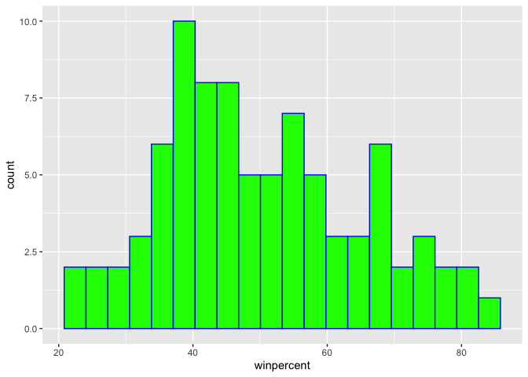
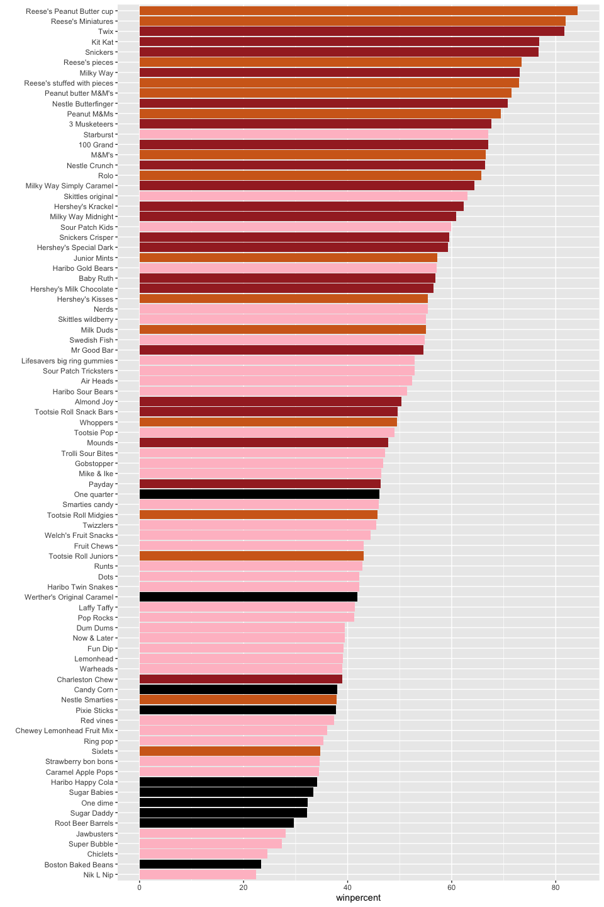
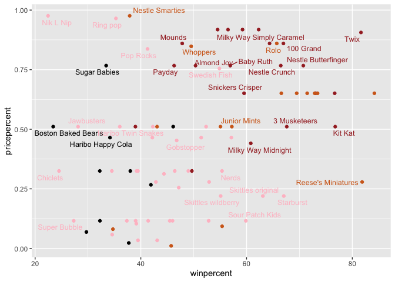
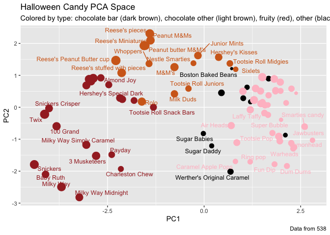

# Class 09: Candy Mini Project
Mason Dinh (PID: A19140455)

- [Background](#background)
- [Data Import](#data-import)
- [Exploratory Analysis](#exploratory-analysis)
- [Overall Candy Rankings](#overall-candy-rankings)
- [Taking a look at pricepercent](#taking-a-look-at-pricepercent)
- [Exploring the correlation
  structure](#exploring-the-correlation-structure)
- [Principal Component Analysis](#principal-component-analysis)

## Background

Today we are taking a small detour to analyze a dataset (that we have
more intrinsic insight into) with the most useful analysis method we
have learned thus far - Principal Component Analysis (PCA)

## Data Import

The data is all related to halloween candy is from the 538 website.

``` r
candy<-read.csv("candy-data.txt", row.names = 1)
head(candy)
```

                 chocolate fruity caramel peanutyalmondy nougat crispedricewafer
    100 Grand            1      0       1              0      0                1
    3 Musketeers         1      0       0              0      1                0
    One dime             0      0       0              0      0                0
    One quarter          0      0       0              0      0                0
    Air Heads            0      1       0              0      0                0
    Almond Joy           1      0       0              1      0                0
                 hard bar pluribus sugarpercent pricepercent winpercent
    100 Grand       0   1        0        0.732        0.860   66.97173
    3 Musketeers    0   1        0        0.604        0.511   67.60294
    One dime        0   0        0        0.011        0.116   32.26109
    One quarter     0   0        0        0.011        0.511   46.11650
    Air Heads       0   0        0        0.906        0.511   52.34146
    Almond Joy      0   1        0        0.465        0.767   50.34755

> Q1. How many different candy types are in this dataset?

``` r
nrow(candy)
```

    [1] 85

There are 85 different types of candy in this dataset.

> Q2. How many fruity candy types are in the dataset?

``` r
sum(candy$fruity)
```

    [1] 38

There are 38 fruity candy types in this dataset.

> Q3. What is your favorite candy (other than Twix) in the dataset and
> what is it’s winpercent value?

``` r
library(dplyr)
```


    Attaching package: 'dplyr'

    The following objects are masked from 'package:stats':

        filter, lag

    The following objects are masked from 'package:base':

        intersect, setdiff, setequal, union

``` r
candy |> 
  filter(row.names(candy)=="Air Heads") |> 
  select(winpercent, pricepercent, sugarpercent)
```

              winpercent pricepercent sugarpercent
    Air Heads   52.34146        0.511        0.906

> Q4. What is the winpercent value for “Kit Kat”?

``` r
candy["Kit Kat", ]$winpercent
```

    [1] 76.7686

> Q5. What is the winpercent value for “Tootsie Roll Snack Bars”?

``` r
candy["Tootsie Roll Snack Bars", ]$winpercent
```

    [1] 49.6535

There is a useful `skim()` function in the **skimr** package that can
help give you a quick overview.

``` r
library("skimr")
skimr::skim(candy)
```

|                                                  |       |
|:-------------------------------------------------|:------|
| Name                                             | candy |
| Number of rows                                   | 85    |
| Number of columns                                | 12    |
| \_\_\_\_\_\_\_\_\_\_\_\_\_\_\_\_\_\_\_\_\_\_\_   |       |
| Column type frequency:                           |       |
| numeric                                          | 12    |
| \_\_\_\_\_\_\_\_\_\_\_\_\_\_\_\_\_\_\_\_\_\_\_\_ |       |
| Group variables                                  | None  |

Data summary

**Variable type: numeric**

| skim_variable | n_missing | complete_rate | mean | sd | p0 | p25 | p50 | p75 | p100 | hist |
|:---|---:|---:|---:|---:|---:|---:|---:|---:|---:|:---|
| chocolate | 0 | 1 | 0.44 | 0.50 | 0.00 | 0.00 | 0.00 | 1.00 | 1.00 | ▇▁▁▁▆ |
| fruity | 0 | 1 | 0.45 | 0.50 | 0.00 | 0.00 | 0.00 | 1.00 | 1.00 | ▇▁▁▁▆ |
| caramel | 0 | 1 | 0.16 | 0.37 | 0.00 | 0.00 | 0.00 | 0.00 | 1.00 | ▇▁▁▁▂ |
| peanutyalmondy | 0 | 1 | 0.16 | 0.37 | 0.00 | 0.00 | 0.00 | 0.00 | 1.00 | ▇▁▁▁▂ |
| nougat | 0 | 1 | 0.08 | 0.28 | 0.00 | 0.00 | 0.00 | 0.00 | 1.00 | ▇▁▁▁▁ |
| crispedricewafer | 0 | 1 | 0.08 | 0.28 | 0.00 | 0.00 | 0.00 | 0.00 | 1.00 | ▇▁▁▁▁ |
| hard | 0 | 1 | 0.18 | 0.38 | 0.00 | 0.00 | 0.00 | 0.00 | 1.00 | ▇▁▁▁▂ |
| bar | 0 | 1 | 0.25 | 0.43 | 0.00 | 0.00 | 0.00 | 0.00 | 1.00 | ▇▁▁▁▂ |
| pluribus | 0 | 1 | 0.52 | 0.50 | 0.00 | 0.00 | 1.00 | 1.00 | 1.00 | ▇▁▁▁▇ |
| sugarpercent | 0 | 1 | 0.48 | 0.28 | 0.01 | 0.22 | 0.47 | 0.73 | 0.99 | ▇▇▇▇▆ |
| pricepercent | 0 | 1 | 0.47 | 0.29 | 0.01 | 0.26 | 0.47 | 0.65 | 0.98 | ▇▇▇▇▆ |
| winpercent | 0 | 1 | 50.32 | 14.71 | 22.45 | 39.14 | 47.83 | 59.86 | 84.18 | ▃▇▆▅▂ |

> Q6. Is there any variable/column that looks to be on a different scale
> to the majority of the other columns in the dataset?

There are two columns that work differently than the other columns: The
Histogram and Complete_Rate column look to be on a different scale.

> Q7. What do you think a zero and one represent for the
> candy\$chocolate column?

I think a one or zero represents if the candy contains choclate or not.

## Exploratory Analysis

> Q8. Plot a histogram of winpercent values using both base R and
> ggplot2.

``` r
hist(candy$winpercent)
```


``` r
library(ggplot2)
ggplot(candy)+aes(winpercent)+geom_histogram(bins = 20,col="blue",fill="green")
```



> Q9. Is the distribution of winpercent values symmetrical?

No, the distribution is not symmetrical. It appears to be right skewed.

> Q10. Is the center of the distribution above or below 50%?

``` r
summary(candy$winpercent)
```

       Min. 1st Qu.  Median    Mean 3rd Qu.    Max. 
      22.45   39.14   47.83   50.32   59.86   84.18 

> Q11. On average is chocolate candy higher or lower ranked than fruit
> candy?

``` r
mean(candy$winpercent[candy$chocolate == 1])
```

    [1] 60.92153

``` r
mean(candy$winpercent[candy$fruity == 1])
```

    [1] 44.11974

> Q12. Is this difference statistically significant?

``` r
t.test(winpercent ~ chocolate, data = candy)
```


        Welch Two Sample t-test

    data:  winpercent by chocolate
    t = -7.3031, df = 67.539, p-value = 4.164e-10
    alternative hypothesis: true difference in means between group 0 and group 1 is not equal to 0
    95 percent confidence interval:
     -23.91110 -13.64744
    sample estimates:
    mean in group 0 mean in group 1 
           42.14226        60.92153 

Yes, the difference is statistically significant because the p-value is
much less than 0.05.

## Overall Candy Rankings

> Q13. What are the five least liked candy types in this set?

``` r
candy |> arrange(winpercent) |> select(winpercent)|> head(5)
```

                       winpercent
    Nik L Nip            22.44534
    Boston Baked Beans   23.41782
    Chiclets             24.52499
    Super Bubble         27.30386
    Jawbusters           28.12744

> Q14. What are the top 5 all time favorite candy types out of this set?

``` r
candy |> arrange(desc(winpercent)) |> select(winpercent) |> head(5)
```

                              winpercent
    Reese's Peanut Butter cup   84.18029
    Reese's Miniatures          81.86626
    Twix                        81.64291
    Kit Kat                     76.76860
    Snickers                    76.67378

> Q15. Make a first barplot of candy ranking based on winpercent values.

``` r
ggplot(candy) + 
  aes(winpercent, rownames(candy)) +
  geom_col()
```


> Q16. This is quite ugly, use the reorder() function to get the bars
> sorted by winpercent?

``` r
ggplot(candy) + 
  aes(winpercent, reorder(rownames(candy), winpercent)) +
  geom_col()
```


``` r
my_cols = rep("black", nrow(candy))
my_cols[as.logical(candy$chocolate)] = "chocolate"
my_cols[as.logical(candy$bar)] = "brown"
my_cols[as.logical(candy$fruity)] = "pink"
```

``` r
ggplot(candy) + 
  aes(winpercent, reorder(rownames(candy),winpercent)) +
  geom_col(fill=my_cols) +
  ylab("")
```



> Q17. What is the worst ranked chocolate candy?

The worst ranked chocolate candy is Sixlets.

> Q18. What is the best ranked fruity candy?

The best ranked fruity candy is Starburst.

## Taking a look at pricepercent

``` r
library(ggrepel)
ggplot(candy) +
  aes(winpercent,pricepercent , label=rownames(candy)) +
  geom_point(col=my_cols) + 
  geom_text_repel(col=my_cols, size=3.3, max.overlaps = 5)
```



> Q19. Which candy type is the highest ranked in terms of winpercent for
> the least money - i.e. offers the most bang for your buck?

Reese’s miniatures appaer to offer the most bang for your buck.

> Q20. What are the top 5 most expensive candy types in the dataset and
> of these which is the least popular?

Nik L Nip, Nestle Smarties, Ring Pop, Hershey’s Krackel, and Hershey’s
Milk Chocolate appear to be the most expensive candys in this data set.
The least popular one being Nik L Nip.

``` r
candy |> arrange(desc(pricepercent)) |> select(pricepercent) |> head(5)
```

                             pricepercent
    Nik L Nip                       0.976
    Nestle Smarties                 0.976
    Ring pop                        0.965
    Hershey's Krackel               0.918
    Hershey's Milk Chocolate        0.918

## Exploring the correlation structure

``` r
library(corrplot)
```

    corrplot 0.95 loaded

``` r
cij <- cor(candy)
corrplot(cij)
```


> Q22. Examining this plot what two variables are anti-correlated
> (i.e. have minus values)?

Chocolate and Fruity are the two variables that are the most
anti-correlated.

> Q23. Use your corrplot result to make a prediction: which variables do
> you expect will have the largest contributions (i.e. loadings) to PC1
> (i.e., drive the most separation between candies along the first
> principal component)?

From the plot, I think chocolate and fruity will have the largest
contritbuion because they’re the most anti-correlated variables on the
plot and have the most negative values.

## Principal Component Analysis

In this case we want to be sure to set `scale=TRUE()` argument for
`prcomp()` because we have one variable, `winpercent()`, that is on a
very different scale than all others and would otherwise dominate our
PCA results.

``` r
pca <- prcomp(candy, scale = TRUE)
summary(pca)
```

    Importance of components:
                              PC1    PC2    PC3     PC4    PC5     PC6     PC7
    Standard deviation     2.0788 1.1378 1.1092 1.07533 0.9518 0.81923 0.81530
    Proportion of Variance 0.3601 0.1079 0.1025 0.09636 0.0755 0.05593 0.05539
    Cumulative Proportion  0.3601 0.4680 0.5705 0.66688 0.7424 0.79830 0.85369
                               PC8     PC9    PC10    PC11    PC12
    Standard deviation     0.74530 0.67824 0.62349 0.43974 0.39760
    Proportion of Variance 0.04629 0.03833 0.03239 0.01611 0.01317
    Cumulative Proportion  0.89998 0.93832 0.97071 0.98683 1.00000

First major result figure in the “score plot” of PC1 vs PC2 - how
different candy are related to each other on our new PC axis:

``` r
plot(pca$x[, 1:2])
```


``` r
plot(pca$x[,1:2], col=my_cols, pch=16)
```


``` r
my_data <- cbind(candy, pca$x[,1:3])
p <- ggplot(my_data) + 
        aes(x=PC1, y=PC2, 
            size=winpercent/100,  
            text=rownames(my_data),
            label=rownames(my_data)) +
        geom_point(col=my_cols)
p
```


``` r
library(ggrepel)

p + geom_text_repel(size=3.3, col=my_cols, max.overlaps = 7)  + 
  theme(legend.position = "none") +
  labs(title="Halloween Candy PCA Space",
       subtitle="Colored by type: chocolate bar (dark brown), chocolate other (light brown), fruity (red), other (black)",
       caption="Data from 538")
```



``` r
library(plotly) # ruined my PDF so I hid the result.
ggplotly(p)
```

``` r
ggplot(pca$rotation) +
  aes(PC1, reorder(rownames(pca$rotation), PC1)) +
  geom_col()
```


> Q24. Complete the code to generate the loadings plot above. What
> original variables are picked up strongly by PC1 in the positive
> direction? Do these make sense to you? Where did you see this
> relationship highlighted previously?

The variables fruity, pluribus, and hard are picked up strongly by PC1
in the positive direction. We saw these relationships in the corrplot
previously where these variables have positive correlations.

> Q25. Based on your exploratory analysis, correlation findings, and PCA
> results, what combination of characteristics appears to make a
> “winning” candy? How do these different analyses (visualization,
> correlation, PCA) support or complement each other in reaching this
> conclusion?

Based on the results of this lab, a “winning” candy’s characteristics
appear to be a chocolate bar with a higher price point, as there was
correlation between the price and the popularity. Additonal
characteristics like peanut-almondy or crisped rice wafer also appear to
contribute to a winning candy. The barplot visualization allowed me to
see what types of candy were the most popular, which was Reese’s
chocolate. The correlation helped me identify which characteristics are
positively correlated with winpercent. Then lastly, the PCA showed that
chocolate bar candy with additonal features were in the same direction
as winpercent, which confirmed which characteristics make up a winning
candy.
