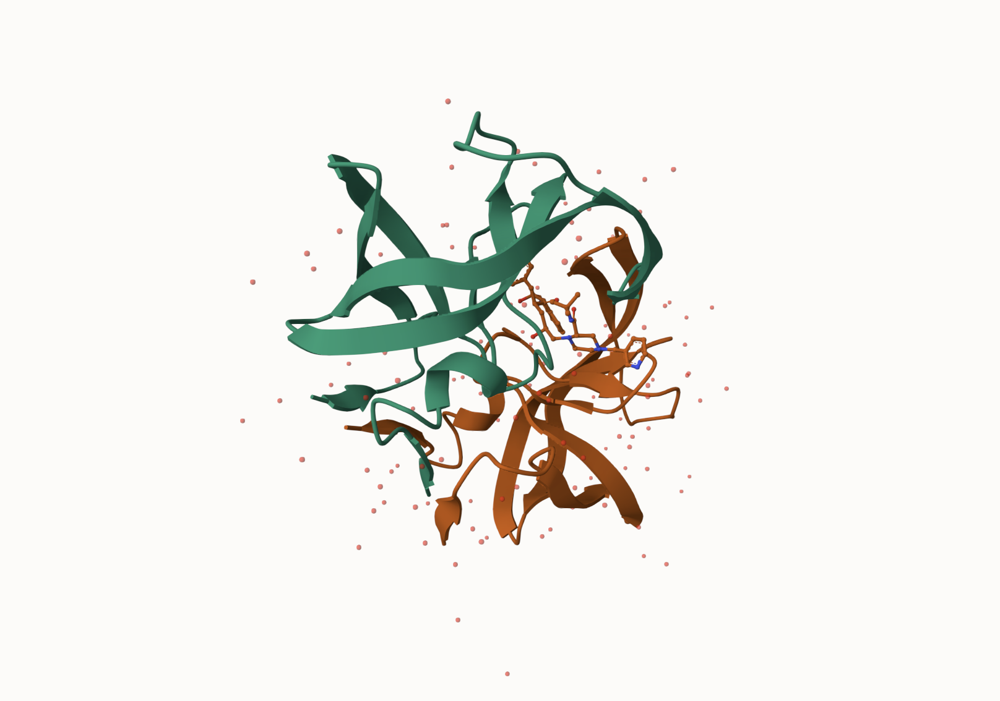
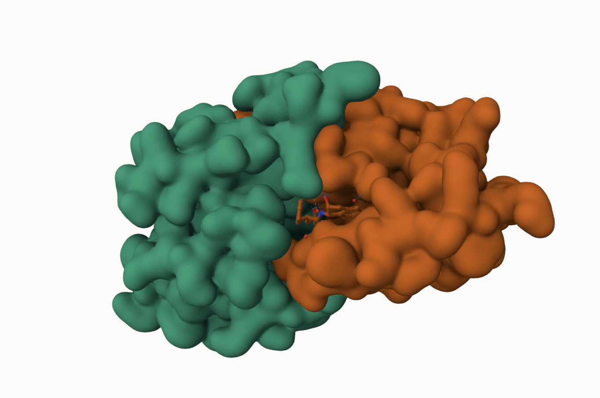
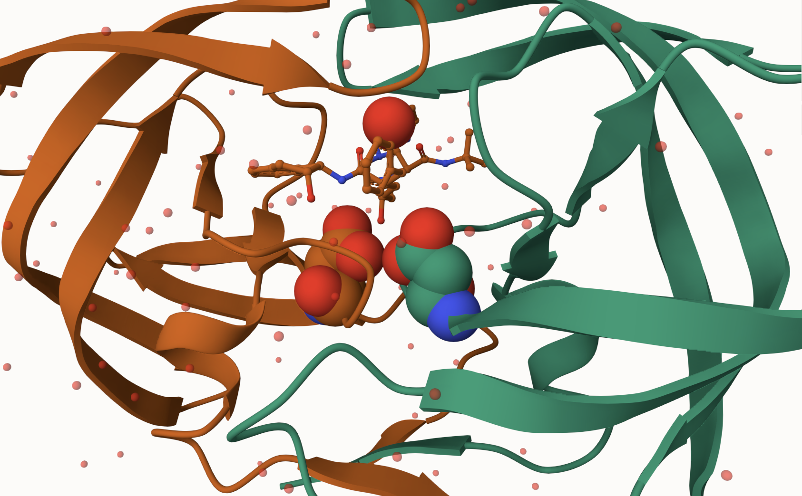

## Background

The main repository of high-resolution structural data on biomolecules is called the **Protein Data Base** (PDB).

## PDB Statistics

What is in teh PDB in terms of molecule type and structure determination method?

```{r}
pdb<-read.csv("Data Export Summary.csv")
pdb
```

> Q1: What percentage of structures in the PDB are solved by X-Ray and Electron Microscopy?

```{r}
pdb$X.ray
```

```{r}
pdb$EM
```
This print out above `pdb$x.ray` is "character" and not "numeric". Therefore I cannot do math with it.

Two functions that can help are `sub()` and `as.numeric()`
```{r}
# We want to get rid (or sub out) commas:
x<- pdb$X.ray
tmp<-sub(",", "", x = pdb$X.ray)
sum(as.numeric(tmp))
```

We could make a function to do this:

```{r}
rm.comma<-function(x){
  tmp<-sub(",", "", x = pdb$EM)
sum(as.numeric(tmp))
}
```

```{r}
n.tot<-rm.comma(pdb$Total)
n.xray<-rm.comma(pdb$X.ray)
n.em <-rm.comma(pdb$EM)
```

We could also use a different import function for this CSV that speaks American (i.e. deals with commas in numbers in a comma separated value file)


```{r}
pdb$Neutron
```

```{r}
library(readr)
read.csv("Data Export Summary.csv")
```

```{r}
pdb$Total <- as.numeric(gsub(",", "", pdb$Total))
pdb$X.ray <- as.numeric(gsub(",", "", pdb$X.ray))
pdb$EM    <- as.numeric(gsub(",", "", pdb$EM))
```

```{r}
n.tot  <- sum(pdb$Total)
n.xray <- sum(pdb$X.ray)
n.em   <- sum(pdb$EM)

(n.xray / n.tot) * 100
(n.em / n.tot) * 100
```

> Q2: What proportion of structures in the PDB are protein?

```{r}
pdb$Total[1]
```
The total number of protein sequences in UniProt is 202,556,314

```{r}
(217375/202556314) *100
```


> **Key-point**: we have very, very small structural coverage of known proteins (~0.1%). Most structures we know about (~80%) come from one method (X-Ray crystalography)

> Q3: Professor said to skip

## Visualizing PDB Data with Mol-Star

Main stand alone web version with all features is at https://molstar.org/viewer/







> Q4: Water molecules normally have 3 atoms. Why do we see just one atom per water molecule in this structure?

The only molecule detected in the image is the oxygen molecule of water. We only see one atom because hydrogen atoms are extremely small and have a very low electron density, as they only have one electron.

> Q5: There is a critical “conserved” water molecule in the binding site. Can you identify this water molecule? What residue number does this water molecule have

The residue number of this water molecule is 308.

> Q6: Generate and save a figure clearly showing the two distinct chains of HIV-protease along with the ligand. You might also consider showing the catalytic residues ASP 25 in each chain and the critical water (we recommend “Ball & Stick” for these side-chains). Add this figure to your Quarto document.

The figure is above.

# Getting started with the Bio3D package

Bio3D is an R package from CRAN for structural bioinfomatics

```{r}
library(bio3d)

pdb<-read.pdb("1hsg")
pdb
```

> Q7: How many amino acid residues are there in this pdb object? 

There are 198 amino acid residues.

> Q8: Name one of the two non-protein residues? 

One of the two non-protein residues is HOH (water)

> Q9: How many protein chains are in this structure? 

There are two protein chains in this structure.


```{r}
attributes(pdb)
```

```{r}
head(pdb$atom)
```

```{r}
head(pdbseq(pdb))
```

```{r}
library(bio3dview)
view.pdb(pdb)
```

> Q10. Which of the packages above is found only on BioConductor and not CRAN? 

The msa pacjage is found only on BioConductor and not CRAN.

> Q11. Which of the above packages is not found on BioConductor or CRAN?: 

The bio3dview package is not found on BioConductor or CRAN.

> Q12. True or False? Functions from the pak package can be used to install packages from GitHub and BitBucket? 

True.

Let's try a custom view
```{r}
view.pdb(pdb,colorScheme="sse", backgroundColor = "Black")
```

> Q. create a custom view highlighting the active site ASP (`resno=25`), the two chains (in your choice of colors) and the ligand all on a custom color background. 

```{r}
library(NGLVieweR)

active.site<-atom.select(pdb,resno=25)

view.pdb(pdb, cols = c("red","blue"),highlight = active.site, highlight.style = "spacefill", backgroundColor = "pink") |> setRock()
```

## Predict the flexibility of a given structure

Let's do a normal mode analysis (NMA) to predict the flexibility of a give `pdb` object: 

```{r}
adk<-read.pdb("6s36")
adk
```

```{r}
m<-nma(adk)
plot(m)
```

View the results with an interactive structue view:
```{r}
view.nma(m)
```

Write out the results for viewing in Mol-star:

```{r}
mktrj(m,file="nma.pdb")
```

## Comparative structure analysis of Adenylate Kinase 

Our first step is find a sequence for this family. We will use the database ID "1ake_A" here:

```{r}
id<-"1ake_A"

aa<-get.seq(id)
aa
```

> Q13. How many amino acids are in this sequence, i.e. how long is this sequence? 

There are 214 amino acids in this sequence, which also makes up the length of this sequence.

Search for releated sequences in the database

```{r}
blast<-blast.pdb(aa)
```

```{r}

head(blast$hit.tbl)
```

```{r}
hits<-plot(blast)
```

```{r}
hits$pdb.id
```

```{r}
files <- get.pdb(hits$pdb.id, path="pdbs", split=TRUE, gzip=TRUE)

```

Align and superimpose all these ADK structures

```{r}
pdbs <- pdbaln(files, fit = TRUE, exefile="msa")

```

```{r}
pdbs
```

```{r}
view.pdbs(pdbs)
```

PCA of all this structural data (x,y, and z atom coordinates):

```{r}
pc<-pca(pdbs)
plot(pc)
```

```{r}
plot(pc,1:2)
```

Interactive View of the MC1 captured structural differences:

```{r}
view.pca(pc)
```

```{r}
mktrj(pc,file="pca.pdb")
```

```{r}
ids <- basename.pdb(pdbs$id)

anno <- pdb.annotate(ids)
unique(anno$source)
```

```{r}
modes <- nma(pdbs)
```

```{r}
rd <- rmsd(pdbs)

hc.rd <- hclust(dist(rd))
grps.rd <- cutree(hc.rd, k=3)
pc.xray <- pca(pdbs)
plot(pc.xray, 1:2, col="grey50", bg=grps.rd, pch=21, cex=1)
```

```{r}
library(ggplot2)
library(ggrepel)

df <- data.frame(PC1=pc.xray$z[,1], 
                 PC2=pc.xray$z[,2], 
                 col=as.factor(grps.rd),
                 ids=ids)

p <- ggplot(df) + 
  aes(PC1, PC2, col=col, label=ids) +
  geom_point(size=2) +
  geom_text_repel(max.overlaps = 20) +
  theme(legend.position = "none")
p
```

```{r}
plot(modes, pdbs, col=grps.rd)
```

> Q14. What do you note about this plot? Are the black and colored lines similar or different? Where do you think they differ most and why?

The black and colored lines are relatively similar because they tend to follow the same trend, but they differ most in their magnitude as the colored lines have a much larger peak than the black line. They differ the most around 140 and this could be due to confirmational change of the protein. 
