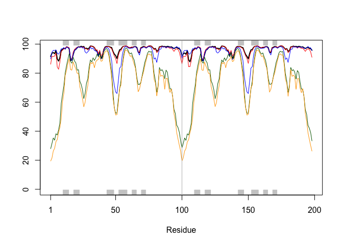
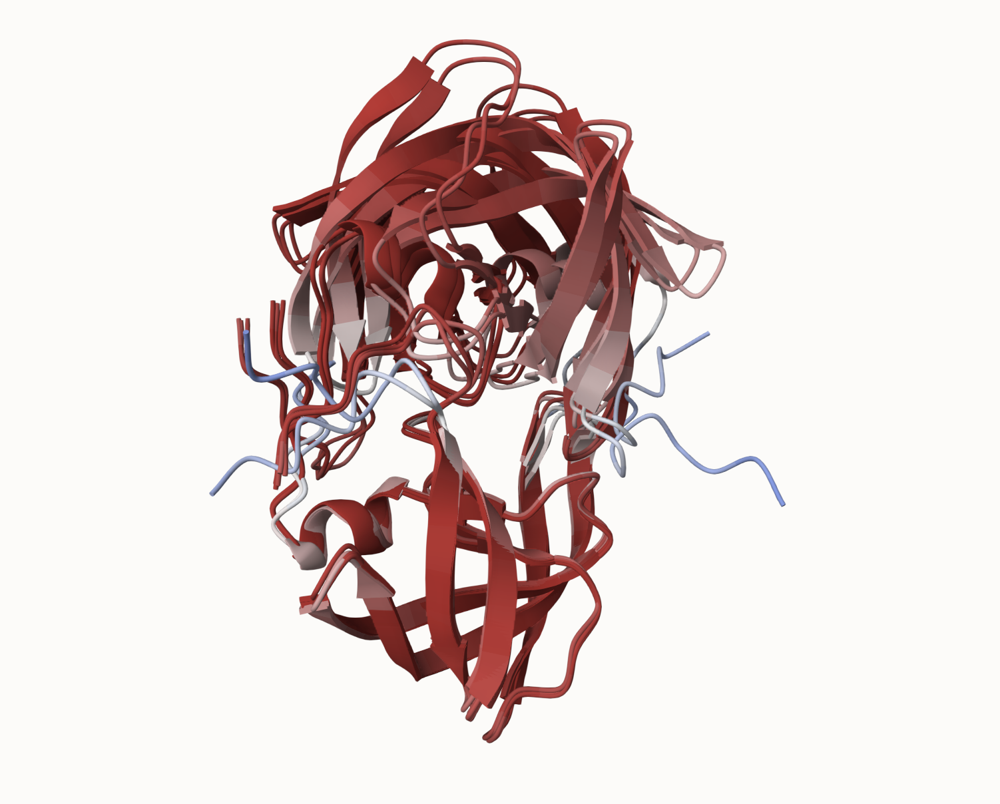
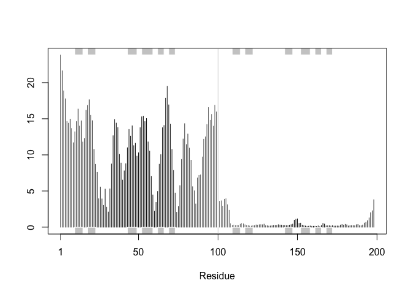
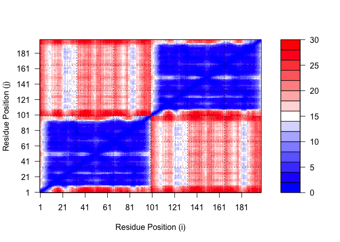
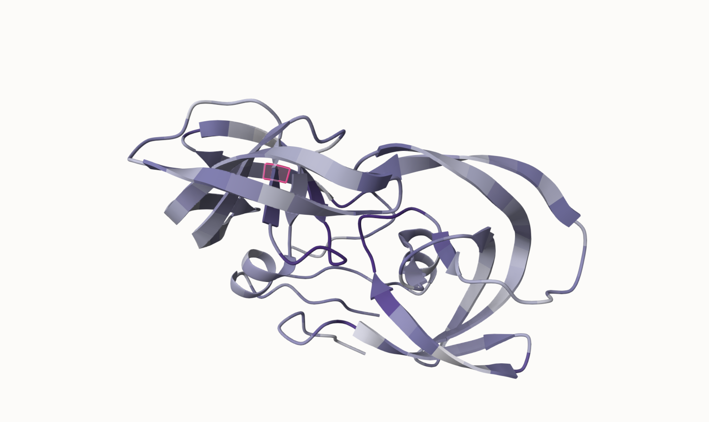

# Class 11: AlphaFold
Mason Dinh (PID: A19140455)

- [Custom analysis of resulting
  models](#custom-analysis-of-resulting-models)
- [Predicted Alignment Error for
  domains](#predicted-alignment-error-for-domains)
- [Residue conservation from alignment
  file](#residue-conservation-from-alignment-file)

## Custom analysis of resulting models

``` r
results_dir <- "dimer_23119/" 
```

``` r
# File names for all PDB models
pdb_files <- list.files(path=results_dir,
                        pattern="*.pdb",
                        full.names = TRUE)

# Print our PDB file names
basename(pdb_files)
```

    [1] "dimer_23119_unrelaxed_rank_001_alphafold2_multimer_v3_model_4_seed_000.pdb"
    [2] "dimer_23119_unrelaxed_rank_002_alphafold2_multimer_v3_model_1_seed_000.pdb"
    [3] "dimer_23119_unrelaxed_rank_003_alphafold2_multimer_v3_model_5_seed_000.pdb"
    [4] "dimer_23119_unrelaxed_rank_004_alphafold2_multimer_v3_model_2_seed_000.pdb"
    [5] "dimer_23119_unrelaxed_rank_005_alphafold2_multimer_v3_model_3_seed_000.pdb"

``` r
library(bio3d)

# Read all data from Models 
#  and superpose/fit coords
pdbs <- pdbaln(pdb_files, fit=TRUE, exefile="msa")
```

    Reading PDB files:
    dimer_23119//dimer_23119_unrelaxed_rank_001_alphafold2_multimer_v3_model_4_seed_000.pdb
    dimer_23119//dimer_23119_unrelaxed_rank_002_alphafold2_multimer_v3_model_1_seed_000.pdb
    dimer_23119//dimer_23119_unrelaxed_rank_003_alphafold2_multimer_v3_model_5_seed_000.pdb
    dimer_23119//dimer_23119_unrelaxed_rank_004_alphafold2_multimer_v3_model_2_seed_000.pdb
    dimer_23119//dimer_23119_unrelaxed_rank_005_alphafold2_multimer_v3_model_3_seed_000.pdb
    .....

    Extracting sequences

    pdb/seq: 1   name: dimer_23119//dimer_23119_unrelaxed_rank_001_alphafold2_multimer_v3_model_4_seed_000.pdb 
    pdb/seq: 2   name: dimer_23119//dimer_23119_unrelaxed_rank_002_alphafold2_multimer_v3_model_1_seed_000.pdb 
    pdb/seq: 3   name: dimer_23119//dimer_23119_unrelaxed_rank_003_alphafold2_multimer_v3_model_5_seed_000.pdb 
    pdb/seq: 4   name: dimer_23119//dimer_23119_unrelaxed_rank_004_alphafold2_multimer_v3_model_2_seed_000.pdb 
    pdb/seq: 5   name: dimer_23119//dimer_23119_unrelaxed_rank_005_alphafold2_multimer_v3_model_3_seed_000.pdb 

``` r
pdbs
```

                                   1        .         .         .         .         50 
    [Truncated_Name:1]dimer_2311   PQITLWQRPLVTIKIGGQLKEALLDTGADDTVLEEMSLPGRWKPKMIGGI
    [Truncated_Name:2]dimer_2311   PQITLWQRPLVTIKIGGQLKEALLDTGADDTVLEEMSLPGRWKPKMIGGI
    [Truncated_Name:3]dimer_2311   PQITLWQRPLVTIKIGGQLKEALLDTGADDTVLEEMSLPGRWKPKMIGGI
    [Truncated_Name:4]dimer_2311   PQITLWQRPLVTIKIGGQLKEALLDTGADDTVLEEMSLPGRWKPKMIGGI
    [Truncated_Name:5]dimer_2311   PQITLWQRPLVTIKIGGQLKEALLDTGADDTVLEEMSLPGRWKPKMIGGI
                                   ************************************************** 
                                   1        .         .         .         .         50 

                                  51        .         .         .         .         100 
    [Truncated_Name:1]dimer_2311   GGFIKVRQYDQILIEICGHKAIGTVLVGPTPVNIIGRNLLTQIGCTLNFP
    [Truncated_Name:2]dimer_2311   GGFIKVRQYDQILIEICGHKAIGTVLVGPTPVNIIGRNLLTQIGCTLNFP
    [Truncated_Name:3]dimer_2311   GGFIKVRQYDQILIEICGHKAIGTVLVGPTPVNIIGRNLLTQIGCTLNFP
    [Truncated_Name:4]dimer_2311   GGFIKVRQYDQILIEICGHKAIGTVLVGPTPVNIIGRNLLTQIGCTLNFP
    [Truncated_Name:5]dimer_2311   GGFIKVRQYDQILIEICGHKAIGTVLVGPTPVNIIGRNLLTQIGCTLNFP
                                   ************************************************** 
                                  51        .         .         .         .         100 

                                 101        .         .         .         .         150 
    [Truncated_Name:1]dimer_2311   QITLWQRPLVTIKIGGQLKEALLDTGADDTVLEEMSLPGRWKPKMIGGIG
    [Truncated_Name:2]dimer_2311   QITLWQRPLVTIKIGGQLKEALLDTGADDTVLEEMSLPGRWKPKMIGGIG
    [Truncated_Name:3]dimer_2311   QITLWQRPLVTIKIGGQLKEALLDTGADDTVLEEMSLPGRWKPKMIGGIG
    [Truncated_Name:4]dimer_2311   QITLWQRPLVTIKIGGQLKEALLDTGADDTVLEEMSLPGRWKPKMIGGIG
    [Truncated_Name:5]dimer_2311   QITLWQRPLVTIKIGGQLKEALLDTGADDTVLEEMSLPGRWKPKMIGGIG
                                   ************************************************** 
                                 101        .         .         .         .         150 

                                 151        .         .         .         .       198 
    [Truncated_Name:1]dimer_2311   GFIKVRQYDQILIEICGHKAIGTVLVGPTPVNIIGRNLLTQIGCTLNF
    [Truncated_Name:2]dimer_2311   GFIKVRQYDQILIEICGHKAIGTVLVGPTPVNIIGRNLLTQIGCTLNF
    [Truncated_Name:3]dimer_2311   GFIKVRQYDQILIEICGHKAIGTVLVGPTPVNIIGRNLLTQIGCTLNF
    [Truncated_Name:4]dimer_2311   GFIKVRQYDQILIEICGHKAIGTVLVGPTPVNIIGRNLLTQIGCTLNF
    [Truncated_Name:5]dimer_2311   GFIKVRQYDQILIEICGHKAIGTVLVGPTPVNIIGRNLLTQIGCTLNF
                                   ************************************************ 
                                 151        .         .         .         .       198 

    Call:
      pdbaln(files = pdb_files, fit = TRUE, exefile = "msa")

    Class:
      pdbs, fasta

    Alignment dimensions:
      5 sequence rows; 198 position columns (198 non-gap, 0 gap) 

    + attr: xyz, resno, b, chain, id, ali, resid, sse, call

``` r
rd <- rmsd(pdbs, fit=T)
```

    Warning in rmsd(pdbs, fit = T): No indices provided, using the 198 non NA positions

``` r
range(rd)
```

    [1]  0.000 14.428

``` r
library(pheatmap)

colnames(rd) <- paste0("m",1:5)
rownames(rd) <- paste0("m",1:5)
pheatmap(rd)
```


``` r
pdb <- read.pdb("1hsg")
```

      Note: Accessing on-line PDB file

``` r
plotb3(pdbs$b[1,], typ="l", lwd=2, sse=pdb)
points(pdbs$b[2,], typ="l", col="red")
points(pdbs$b[3,], typ="l", col="blue")
points(pdbs$b[4,], typ="l", col="darkgreen")
points(pdbs$b[5,], typ="l", col="orange")
abline(v=100, col="gray")
```



``` r
core <- core.find(pdbs)
```

     core size 197 of 198  vol = 8545.056 
     core size 196 of 198  vol = 7894.785 
     core size 195 of 198  vol = 3576.128 
     core size 194 of 198  vol = 1851.054 
     core size 193 of 198  vol = 1697.206 
     core size 192 of 198  vol = 1612.776 
     core size 191 of 198  vol = 1530.209 
     core size 190 of 198  vol = 1447.409 
     core size 189 of 198  vol = 1377.118 
     core size 188 of 198  vol = 1303.827 
     core size 187 of 198  vol = 1239.041 
     core size 186 of 198  vol = 1188.139 
     core size 185 of 198  vol = 1118.474 
     core size 184 of 198  vol = 1071.675 
     core size 183 of 198  vol = 1034.016 
     core size 182 of 198  vol = 980.835 
     core size 181 of 198  vol = 942.247 
     core size 180 of 198  vol = 911.395 
     core size 179 of 198  vol = 879.756 
     core size 178 of 198  vol = 834.466 
     core size 177 of 198  vol = 785.268 
     core size 176 of 198  vol = 762.122 
     core size 175 of 198  vol = 722.029 
     core size 174 of 198  vol = 700.395 
     core size 173 of 198  vol = 677.257 
     core size 172 of 198  vol = 657.81 
     core size 171 of 198  vol = 632.907 
     core size 170 of 198  vol = 614.198 
     core size 169 of 198  vol = 591.516 
     core size 168 of 198  vol = 573.979 
     core size 167 of 198  vol = 552.403 
     core size 166 of 198  vol = 529.489 
     core size 165 of 198  vol = 500.545 
     core size 164 of 198  vol = 482.517 
     core size 163 of 198  vol = 458.426 
     core size 162 of 198  vol = 444.455 
     core size 161 of 198  vol = 433.581 
     core size 160 of 198  vol = 419.086 
     core size 159 of 198  vol = 404.934 
     core size 158 of 198  vol = 393.803 
     core size 157 of 198  vol = 383.003 
     core size 156 of 198  vol = 366.654 
     core size 155 of 198  vol = 352.026 
     core size 154 of 198  vol = 335.663 
     core size 153 of 198  vol = 319.398 
     core size 152 of 198  vol = 307.935 
     core size 151 of 198  vol = 296.818 
     core size 150 of 198  vol = 284.289 
     core size 149 of 198  vol = 273.459 
     core size 148 of 198  vol = 261.978 
     core size 147 of 198  vol = 249.6 
     core size 146 of 198  vol = 237.954 
     core size 145 of 198  vol = 226.1 
     core size 144 of 198  vol = 213.265 
     core size 143 of 198  vol = 200.214 
     core size 142 of 198  vol = 187.504 
     core size 141 of 198  vol = 177.525 
     core size 140 of 198  vol = 167.372 
     core size 139 of 198  vol = 160.875 
     core size 138 of 198  vol = 154.455 
     core size 137 of 198  vol = 148.439 
     core size 136 of 198  vol = 142.13 
     core size 135 of 198  vol = 136.529 
     core size 134 of 198  vol = 130.77 
     core size 133 of 198  vol = 123.868 
     core size 132 of 198  vol = 117.609 
     core size 131 of 198  vol = 112.71 
     core size 130 of 198  vol = 106.361 
     core size 129 of 198  vol = 100.591 
     core size 128 of 198  vol = 95.718 
     core size 127 of 198  vol = 91.068 
     core size 126 of 198  vol = 86.862 
     core size 125 of 198  vol = 82.309 
     core size 124 of 198  vol = 78.554 
     core size 123 of 198  vol = 74.632 
     core size 122 of 198  vol = 70.489 
     core size 121 of 198  vol = 66.802 
     core size 120 of 198  vol = 62.901 
     core size 119 of 198  vol = 59.152 
     core size 118 of 198  vol = 55.75 
     core size 117 of 198  vol = 51.832 
     core size 116 of 198  vol = 48.3 
     core size 115 of 198  vol = 44.927 
     core size 114 of 198  vol = 42.418 
     core size 113 of 198  vol = 39.425 
     core size 112 of 198  vol = 37.381 
     core size 111 of 198  vol = 33.06 
     core size 110 of 198  vol = 28.153 
     core size 109 of 198  vol = 25.33 
     core size 108 of 198  vol = 22.509 
     core size 107 of 198  vol = 20.695 
     core size 106 of 198  vol = 18.754 
     core size 105 of 198  vol = 17.757 
     core size 104 of 198  vol = 16.712 
     core size 103 of 198  vol = 15.44 
     core size 102 of 198  vol = 14.745 
     core size 101 of 198  vol = 14.758 
     core size 100 of 198  vol = 13.11 
     core size 99 of 198  vol = 11.018 
     core size 98 of 198  vol = 8.967 
     core size 97 of 198  vol = 7.643 
     core size 96 of 198  vol = 6.326 
     core size 95 of 198  vol = 5.37 
     core size 94 of 198  vol = 4.312 
     core size 93 of 198  vol = 3.391 
     core size 92 of 198  vol = 2.697 
     core size 91 of 198  vol = 1.911 
     core size 90 of 198  vol = 1.577 
     core size 89 of 198  vol = 1.144 
     core size 88 of 198  vol = 0.826 
     core size 87 of 198  vol = 0.594 
     core size 86 of 198  vol = 0.494 
     FINISHED: Min vol ( 0.5 ) reached

``` r
core.inds <- print(core, vol=0.5)
```

    # 87 positions (cumulative volume <= 0.5 Angstrom^3) 
      start end length
    1     8  50     43
    2    52  95     44

``` r
xyz <- pdbfit(pdbs, core.inds, outpath="corefit_structures")
xyz
```


       Total Frames#: 5
       Total XYZs#:   594,  (Atoms#:  198)

        [1]  -17  4.836  3.725  <...>  -9.78  1.16  3.854  [2970] 

    + attr: Matrix DIM = 5 x 594



``` r
rf <- rmsf(xyz)

plotb3(rf, sse=pdb)
abline(v=100, col="gray", ylab="RMSF")
```



## Predicted Alignment Error for domains

``` r
library(jsonlite)

# Listing of all PAE JSON files
pae_files <- list.files(path=results_dir,
                        pattern=".*model.*\\.json",
                        full.names = TRUE)
```

``` r
pae1 <- read_json(pae_files[1],simplifyVector = TRUE)
pae5 <- read_json(pae_files[5],simplifyVector = TRUE)

attributes(pae1)
```

    $names
    [1] "plddt"   "max_pae" "pae"     "ptm"     "iptm"   

``` r
head(pae1$plddt) 
```

    [1] 91.44 93.75 94.19 93.44 95.62 89.81

``` r
pae1$max_pae
```

    [1] 13.13281

``` r
pae5$max_pae
```

    [1] 29.71875

``` r
plot.dmat(pae1$pae, 
          xlab="Residue Position (i)",
          ylab="Residue Position (j)")
```


``` r
plot.dmat(pae5$pae, 
          xlab="Residue Position (i)",
          ylab="Residue Position (j)",
          grid.col = "black",
          zlim=c(0,30))
```



``` r
plot.dmat(pae1$pae, 
          xlab="Residue Position (i)",
          ylab="Residue Position (j)",
          grid.col = "black",
          zlim=c(0,30))
```


## Residue conservation from alignment file

``` r
aln_file <- list.files(path=results_dir,
                       pattern=".a3m$",
                        full.names = TRUE)
aln_file
```

    [1] "dimer_23119//dimer_23119.a3m"

``` r
aln <- read.fasta(aln_file[1], to.upper = TRUE)
```

    [1] " ** Duplicated sequence id's: 101 **"
    [2] " ** Duplicated sequence id's: 101 **"

``` r
dim(aln$ali)
```

    [1] 5397  132

``` r
sim <- conserv(aln)
```

``` r
plotb3(sim[1:99], sse=trim.pdb(pdb, chain="A"),
       ylab="Conservation Score")
```


``` r
con <- consensus(aln, cutoff = 0.9)
con$seq
```

      [1] "-" "-" "-" "-" "-" "-" "-" "-" "-" "-" "-" "-" "-" "-" "-" "-" "-" "-"
     [19] "-" "-" "-" "-" "-" "-" "D" "T" "G" "A" "-" "-" "-" "-" "-" "-" "-" "-"
     [37] "-" "-" "-" "-" "-" "-" "-" "-" "-" "-" "-" "-" "-" "-" "-" "-" "-" "-"
     [55] "-" "-" "-" "-" "-" "-" "-" "-" "-" "-" "-" "-" "-" "-" "-" "-" "-" "-"
     [73] "-" "-" "-" "-" "-" "-" "-" "-" "-" "-" "-" "-" "-" "-" "-" "-" "-" "-"
     [91] "-" "-" "-" "-" "-" "-" "-" "-" "-" "-" "-" "-" "-" "-" "-" "-" "-" "-"
    [109] "-" "-" "-" "-" "-" "-" "-" "-" "-" "-" "-" "-" "-" "-" "-" "-" "-" "-"
    [127] "-" "-" "-" "-" "-" "-"

``` r
m1.pdb <- read.pdb(pdb_files[1])
occ <- vec2resno(c(sim[1:99], sim[1:99]), m1.pdb$atom$resno)
write.pdb(m1.pdb, o=occ, file="m1_conserv.pdb")
```


