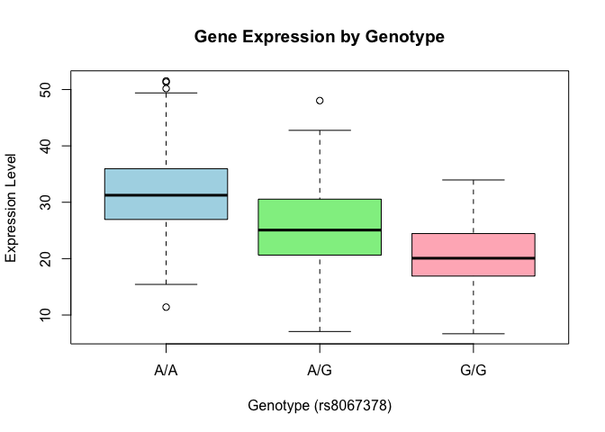

# Class 12: Genome Informatics
Mason Dinh (PID: A19140455)

- [Data Import](#data-import)

## Data Import

> Q13: Read this file into R and determine the sample size for each
> genotype and their corresponding median expression levels for each of
> these genotypes

``` r
dataset <- "https://bioboot.github.io/bggn213_W19/class-material/rs8067378_ENSG00000172057.6.txt"
expr <- read.table(url(dataset))
```

``` r
table(expr$geno)
```


    A/A A/G G/G 
    108 233 121 

``` r
tapply(expr$exp, expr$geno, median)
```

         A/A      A/G      G/G 
    31.24847 25.06486 20.07363 

> Q14: Generate a boxplot with a box per genotype, what could you infer
> from the relative expression value between A/A and G/G displayed in
> this plot? Does the SNP effect the expression of ORMDL3?

``` r
p <- boxplot(exp ~ geno, data=expr, 
             main="Gene Expression by Genotype",
             xlab="Genotype (rs8067378)", 
             ylab="Expression Level",
             col=c("lightblue", "lightgreen", "lightpink"))
```



From the plot, we can see that the A/A genotype has the highest median
at 31.25 and the G/G genotype has the lowest at 20.07. Yes, the SNP
rs8067378 affects the expression of ORMDL3, as seen from the boxplots.

``` r
p$stats
```

             [,1]     [,2]     [,3]
    [1,] 15.42908  7.07505  6.67482
    [2,] 26.95022 20.62572 16.90256
    [3,] 31.24847 25.06486 20.07363
    [4,] 35.95503 30.55183 24.45672
    [5,] 49.39612 42.75662 33.95602
