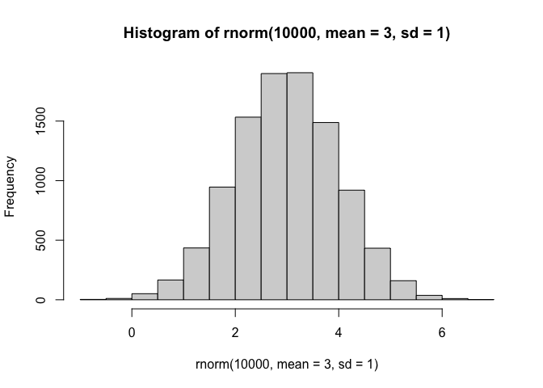
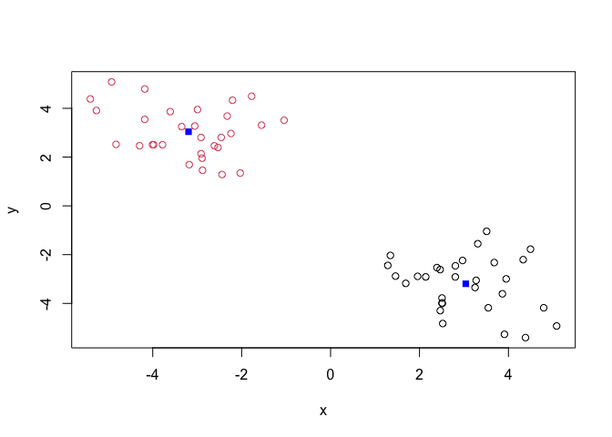
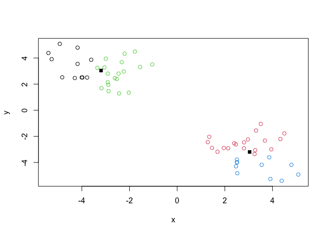
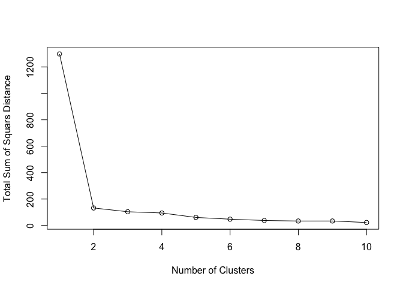
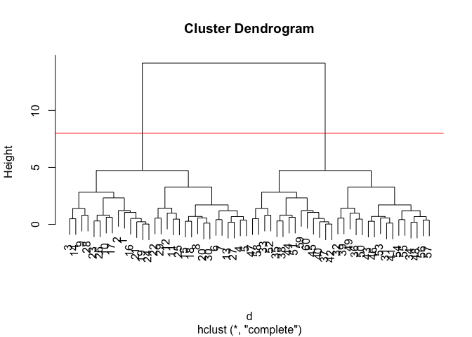
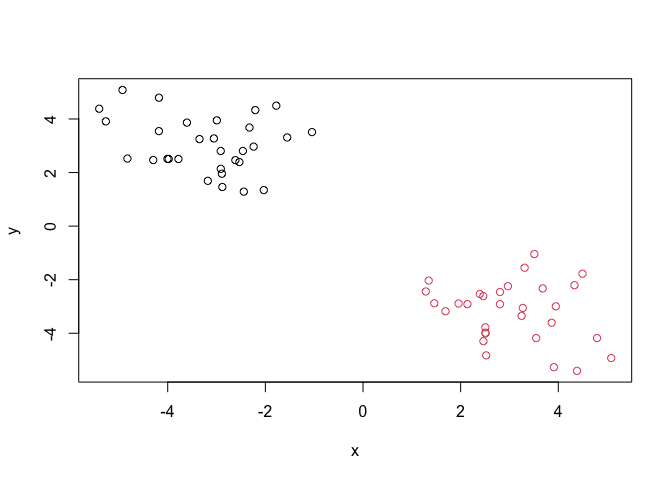
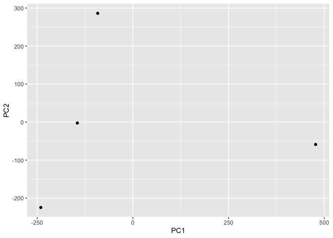
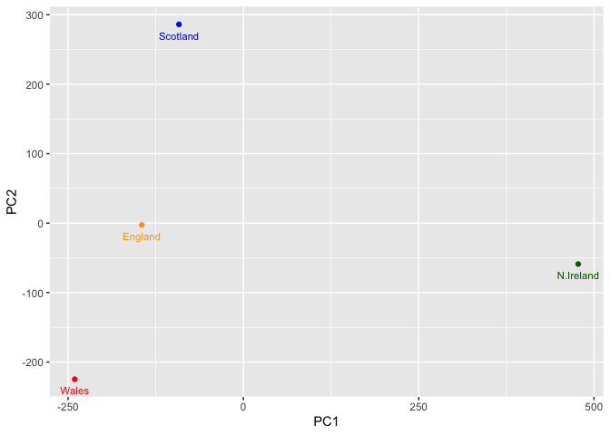
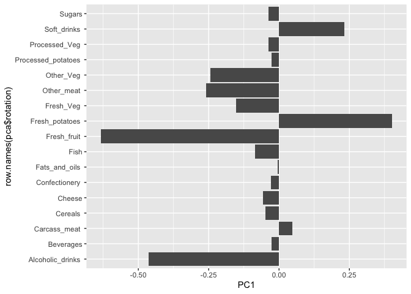

# Class 7: Machine Learning 1
Mason Dinh (PID: A19140455)

- [Background](#background)
- [K-means clustering](#k-means-clustering)
- [Hierarchial Clustering](#hierarchial-clustering)
- [Principal Component Analysis
  (PCA)](#principal-component-analysis-pca)
- [Analysis of UK food data](#analysis-of-uk-food-data)
- [Data Import](#data-import)
- [Tidy data](#tidy-data)
- [Exporatory analysis](#exporatory-analysis)
- [PCA to the rescue](#pca-to-the-rescue)

## Background

Today we will explore some core machine learning methods that are very
popular in bioinformatics. These include **clustering** and
**dimensionallity reduction**.

## K-means clustering

The main function in “base” R for K-means clustering is called
`kmeans()`

Before we go too deep let’s make up some “simple” data that we can
cluster and know if we are getting a good answer or not. To do this we
can use `rnorm()` function:

``` r
rnorm(100)
```

      [1]  0.934549451  0.419704885 -1.700583088 -0.087130823 -1.866916563
      [6] -0.320289291 -1.530377618  1.715738807 -0.601682980  0.084328502
     [11] -0.039979535  0.992063098  0.393179284  0.592140243 -0.734285403
     [16] -0.444139605 -0.865772939  1.712221285  1.333710973 -0.520870938
     [21]  0.291881256  1.255956867  0.599851555 -0.734557045  1.494851246
     [26] -0.888822276 -0.046877232  0.379411814 -1.022632330 -0.129550459
     [31]  0.805833148  0.527396721  0.304908739  0.946639744 -0.320006133
     [36] -0.258327943  0.136690555  1.165318556 -0.902208194 -0.740814714
     [41]  1.574078216 -0.434758443 -0.074835840 -0.452344795  1.219924852
     [46] -1.303056453 -0.520249029 -1.012923822  0.026429308  0.841487719
     [51]  0.109936343  0.671500730  1.678914151 -0.110168646  0.167768841
     [56]  1.144255043  1.236630866 -0.331292042 -0.299688738  1.183349129
     [61]  0.081219087 -1.384263823 -0.902686452  0.021565573  1.059601959
     [66] -1.006909714  0.064037888 -0.732329049  0.835616254  1.480812691
     [71]  0.224745392  1.376454354 -0.041817049 -0.007346184  2.784429692
     [76] -0.176446599  0.245444902 -0.296410410  0.145317383  0.619204862
     [81] -0.850483110 -0.127207309 -0.363673804 -2.164154488 -1.994915876
     [86]  0.170146316  1.747347759 -0.290086610  0.229244076  1.183688444
     [91]  0.617511491 -1.534017091 -1.070716120 -0.354566546 -1.119707703
     [96] -0.651491028 -0.271380498  1.043112500 -0.744115115  0.255549745

``` r
hist(rnorm(10000,mean = 3, sd=1))
```



``` r
x<- c(rnorm(30,-3), rnorm(30,+3))
x
```

     [1] -4.825384 -4.180177 -5.266740 -3.178680 -2.881057 -2.032208 -2.441426
     [8] -2.913764 -4.925745 -2.993457 -2.205899 -2.325511 -2.912695 -5.403319
    [15] -2.459474 -4.296261 -3.606584 -2.240508 -4.004847 -2.532243 -3.780265
    [22] -1.552928 -3.054218 -3.979334 -1.776008 -3.348939 -2.890468 -4.179599
    [29] -1.044650 -2.614385  2.463700  3.510132  4.793577  1.956843  3.249241
    [36]  4.495888  2.507278  3.273582  3.310355  2.506148  2.392203  2.510207
    [43]  2.968397  3.864312  2.466482  2.806387  4.383603  2.139692  3.680967
    [50]  4.331849  3.949189  5.083825  2.804743  1.286565  1.345077  1.460596
    [57]  1.690828  3.910566  3.546669  2.522620

``` r
rev(x)
```

     [1]  2.522620  3.546669  3.910566  1.690828  1.460596  1.345077  1.286565
     [8]  2.804743  5.083825  3.949189  4.331849  3.680967  2.139692  4.383603
    [15]  2.806387  2.466482  3.864312  2.968397  2.510207  2.392203  2.506148
    [22]  3.310355  3.273582  2.507278  4.495888  3.249241  1.956843  4.793577
    [29]  3.510132  2.463700 -2.614385 -1.044650 -4.179599 -2.890468 -3.348939
    [36] -1.776008 -3.979334 -3.054218 -1.552928 -3.780265 -2.532243 -4.004847
    [43] -2.240508 -3.606584 -4.296261 -2.459474 -5.403319 -2.912695 -2.325511
    [50] -2.205899 -2.993457 -4.925745 -2.913764 -2.441426 -2.032208 -2.881057
    [57] -3.178680 -5.266740 -4.180177 -4.825384

``` r
z<-cbind(x = x, y = rev(x))
z
```

                  x         y
     [1,] -4.825384  2.522620
     [2,] -4.180177  3.546669
     [3,] -5.266740  3.910566
     [4,] -3.178680  1.690828
     [5,] -2.881057  1.460596
     [6,] -2.032208  1.345077
     [7,] -2.441426  1.286565
     [8,] -2.913764  2.804743
     [9,] -4.925745  5.083825
    [10,] -2.993457  3.949189
    [11,] -2.205899  4.331849
    [12,] -2.325511  3.680967
    [13,] -2.912695  2.139692
    [14,] -5.403319  4.383603
    [15,] -2.459474  2.806387
    [16,] -4.296261  2.466482
    [17,] -3.606584  3.864312
    [18,] -2.240508  2.968397
    [19,] -4.004847  2.510207
    [20,] -2.532243  2.392203
    [21,] -3.780265  2.506148
    [22,] -1.552928  3.310355
    [23,] -3.054218  3.273582
    [24,] -3.979334  2.507278
    [25,] -1.776008  4.495888
    [26,] -3.348939  3.249241
    [27,] -2.890468  1.956843
    [28,] -4.179599  4.793577
    [29,] -1.044650  3.510132
    [30,] -2.614385  2.463700
    [31,]  2.463700 -2.614385
    [32,]  3.510132 -1.044650
    [33,]  4.793577 -4.179599
    [34,]  1.956843 -2.890468
    [35,]  3.249241 -3.348939
    [36,]  4.495888 -1.776008
    [37,]  2.507278 -3.979334
    [38,]  3.273582 -3.054218
    [39,]  3.310355 -1.552928
    [40,]  2.506148 -3.780265
    [41,]  2.392203 -2.532243
    [42,]  2.510207 -4.004847
    [43,]  2.968397 -2.240508
    [44,]  3.864312 -3.606584
    [45,]  2.466482 -4.296261
    [46,]  2.806387 -2.459474
    [47,]  4.383603 -5.403319
    [48,]  2.139692 -2.912695
    [49,]  3.680967 -2.325511
    [50,]  4.331849 -2.205899
    [51,]  3.949189 -2.993457
    [52,]  5.083825 -4.925745
    [53,]  2.804743 -2.913764
    [54,]  1.286565 -2.441426
    [55,]  1.345077 -2.032208
    [56,]  1.460596 -2.881057
    [57,]  1.690828 -3.178680
    [58,]  3.910566 -5.266740
    [59,]  3.546669 -4.180177
    [60,]  2.522620 -4.825384

``` r
p <- 1:5
cbind(p, rev(p))
```

         p  
    [1,] 1 5
    [2,] 2 4
    [3,] 3 3
    [4,] 4 2
    [5,] 5 1

Now we can run `kmeans()` on this input `z` and see what the results
look like.

``` r
km<-kmeans(z, centers = 2)
km
```

    K-means clustering with 2 clusters of sizes 30, 30

    Cluster means:
              x         y
    1  3.040384 -3.194892
    2 -3.194892  3.040384

    Clustering vector:
     [1] 2 2 2 2 2 2 2 2 2 2 2 2 2 2 2 2 2 2 2 2 2 2 2 2 2 2 2 2 2 2 1 1 1 1 1 1 1 1
    [39] 1 1 1 1 1 1 1 1 1 1 1 1 1 1 1 1 1 1 1 1 1 1

    Within cluster sum of squares by cluster:
    [1] 66.13807 66.13807
     (between_SS / total_SS =  89.8 %)

    Available components:

    [1] "cluster"      "centers"      "totss"        "withinss"     "tot.withinss"
    [6] "betweenss"    "size"         "iter"         "ifault"      

``` r
attributes(km)
```

    $names
    [1] "cluster"      "centers"      "totss"        "withinss"     "tot.withinss"
    [6] "betweenss"    "size"         "iter"         "ifault"      

    $class
    [1] "kmeans"

> Q. how many points are in each cluster?

``` r
km$size
```

    [1] 30 30

> Q. What “components of your result object details cluster
> assignment/membership?

``` r
km$cluster
```

     [1] 2 2 2 2 2 2 2 2 2 2 2 2 2 2 2 2 2 2 2 2 2 2 2 2 2 2 2 2 2 2 1 1 1 1 1 1 1 1
    [39] 1 1 1 1 1 1 1 1 1 1 1 1 1 1 1 1 1 1 1 1 1 1

> Q. What “components of your result object details cluster center?

``` r
km$centers
```

              x         y
    1  3.040384 -3.194892
    2 -3.194892  3.040384

> Q. plot `z` colored by the kmeans cluster assignment and add cluster
> centers as blue points.

``` r
plot(z,col=km$cluster)
points(km$centers,col="blue",pch=15)
```



> Q. Run a K-means clustering and plot the results asking for 4 clusters
> (K=4)?

``` r
km4 <- kmeans(z, centers =4 )
plot(z, col = km4$cluster)
points(km$centers,col="black",pch=15)
```



> **N.B.** you need to tell K-means the number of clusters (i.e. set
> `centers=2`)!!

``` r
km$totss
```

    [1] 1298.636

One approach is to try different values for `centers` and then pick the
best…

``` r
ans<- NULL
for(i in 1:10) {
km <- kmeans(z,centers=i)
ans<-c(ans,km$tot.withinss)
}
ans
```

     [1] 1298.63629  132.27614  103.76315   94.26058   60.69120   47.30846
     [7]   37.51092   33.56245   33.69566   22.23043

``` r
plot(ans, typ="o", xlab= "Number of Clusters", ylab="Total Sum of Squars Distance")
```



## Hierarchial Clustering

The main function in “base” R for hierarchical clustering is called
`hclust()`

This function does not take your “raw” data for clustering. You must
first build a “distance matrix” from your data and pass this as input to
`hclust()`

``` r
d <- dist(z)
hc <- hclust(d)
hc
```


    Call:
    hclust(d = d)

    Cluster method   : complete 
    Distance         : euclidean 
    Number of objects: 60 

There is a bespoke `plot()` method for `hclust()` result objects.

``` r
plot(hc)
abline(h=8,col="red")
```



Once we have our `hclust()` object (our “tree” of “cluster dendrogram”)
we can *“cut”* the tree to reval the clustering pattern.

``` r
cutree(hc,h=8)
```

     [1] 1 1 1 1 1 1 1 1 1 1 1 1 1 1 1 1 1 1 1 1 1 1 1 1 1 1 1 1 1 1 2 2 2 2 2 2 2 2
    [39] 2 2 2 2 2 2 2 2 2 2 2 2 2 2 2 2 2 2 2 2 2 2

``` r
cutree(hc, k=4)
```

     [1] 1 1 1 2 2 2 2 2 1 1 2 2 2 1 2 1 1 2 1 2 1 2 1 1 2 1 2 1 2 2 3 3 4 3 4 3 4 4
    [39] 3 4 3 4 3 4 4 3 4 3 3 3 4 4 3 3 3 3 3 4 4 4

> Q. Make a plot of `z` with your hclust results (i.e. colored by
> cluster membership)

``` r
grps<-cutree(hc,k=2)
plot(z, col=grps)
```



## Principal Component Analysis (PCA)

PCA is a dimensionality reduction method that is popular for revealing
patterns in complex datasets

## Analysis of UK food data

Let’s look at some data on the eating habits of folks from the UK to see
if there are patterns and trends that have some regions being distinct
from others.

## Data Import

The data is made available in CSV format so we can use the `read.csv()`
function

``` r
url <- "https://tinyurl.com/UK-foods"
x <- read.csv(url)
x
```

                         X England Wales Scotland N.Ireland
    1               Cheese     105   103      103        66
    2        Carcass_meat      245   227      242       267
    3          Other_meat      685   803      750       586
    4                 Fish     147   160      122        93
    5       Fats_and_oils      193   235      184       209
    6               Sugars     156   175      147       139
    7      Fresh_potatoes      720   874      566      1033
    8           Fresh_Veg      253   265      171       143
    9           Other_Veg      488   570      418       355
    10 Processed_potatoes      198   203      220       187
    11      Processed_Veg      360   365      337       334
    12        Fresh_fruit     1102  1137      957       674
    13            Cereals     1472  1582     1462      1494
    14           Beverages      57    73       53        47
    15        Soft_drinks     1374  1256     1572      1506
    16   Alcoholic_drinks      375   475      458       135
    17      Confectionery       54    64       62        41

> Q1. How many rows and columns are in your new data frame named x? What
> R functions could you use to answer this questions?

``` r
dim(x)
```

    [1] 17  5

``` r
head(x)
```

                   X England Wales Scotland N.Ireland
    1         Cheese     105   103      103        66
    2  Carcass_meat      245   227      242       267
    3    Other_meat      685   803      750       586
    4           Fish     147   160      122        93
    5 Fats_and_oils      193   235      184       209
    6         Sugars     156   175      147       139

``` r
rownames(x) <- x[,1]
x <- x[,-1]
head(x)
```

                   England Wales Scotland N.Ireland
    Cheese             105   103      103        66
    Carcass_meat       245   227      242       267
    Other_meat         685   803      750       586
    Fish               147   160      122        93
    Fats_and_oils      193   235      184       209
    Sugars             156   175      147       139

``` r
dim(x)
```

    [1] 17  4

> Q2. Which approach to solving the ‘row-names problem’ mentioned above
> do you prefer and why? Is one approach more robust than another under
> certain circumstances?

I prefer the second method to solving the “row-names problem” because it
is much more convenient and can be done much faster than the first
method. However, I think the first method is much more robust because if
gives the user a lot more control over the output of the code.

``` r
library(tidyr)
x_long <- x |> 
          tibble::rownames_to_column("Food") |> 
          pivot_longer(cols = -Food, 
                       names_to = "Country", 
                       values_to = "Consumption")
dim(x_long)
```

    [1] 68  3

``` r
library(ggplot2)
ggplot(x_long) +
  aes(x = Country, y = Consumption, fill = Food) +
  geom_col(position = "dodge") +
  theme_bw()
```


> Q4: Changing what optional argument in the above ggplot() code results
> in a stacked barplot figure?

Changing the position from “dodge” to “stack” will result in a stacked
barplot.

``` r
ggplot(x_long) +
  aes(x = Country, y = Consumption, fill = Food) +
  geom_col(position = "stack") +
  theme_bw()
```


> Q5: We can use the pairs() function to generate all pairwise plots for
> our countries. Can you make sense of the following code and resulting
> figure? What does it mean if a given point lies on the diagonal for a
> given plot?

The pairs() function creates scatterplots that show the relationship
between every pair of variables in the dataset. If a point lies on a
diagonal line in the figure, it means the two variables that are being
compared have the same value.

``` r
pairs(x, col=rainbow(nrow(x)), pch=16)
```


``` r
library(pheatmap)

pheatmap( as.matrix(x) )
```


> Q6. Based on the pairs and heatmap figures, which countries cluster
> together and what does this suggest about their food consumption
> patterns? Can you easily tell what the main differences between N.
> Ireland and the other countries of the UK in terms of this data-set?

The countries that cluster together are England, Wales, and Scotland
because from the plots we can see that their points follow similar
trends. This suggest that these three countries share similar food
consumption patterns. You can tell that there is a difference between
Northern Ireland and the other countries but its hard to see anything
more specific.

## Tidy data

``` r
library(tidyr)
x_long <- x |> 
          tibble::rownames_to_column("Food") |> 
          pivot_longer(cols = -Food, 
                       names_to = "Country", 
                       values_to = "Consumption")
dim(x_long)
```

    [1] 68  3

``` r
head(x_long)
```

    # A tibble: 6 × 3
      Food            Country   Consumption
      <chr>           <chr>           <int>
    1 "Cheese"        England           105
    2 "Cheese"        Wales             103
    3 "Cheese"        Scotland          103
    4 "Cheese"        N.Ireland          66
    5 "Carcass_meat " England           245
    6 "Carcass_meat " Wales             227

Fix anything that went wrong with data import.

## Exporatory analysis

Make some plots to help make sense of obvious trends…

``` r
barplot(as.matrix(x), beside=T, col=rainbow(nrow(x)))
```


> Q3: Changing what optional argument in the above barplot() function
> results in the following plot?

Changing the `beside()` function from TRUE to FALSE will stack the bars.

``` r
barplot(as.matrix(x), beside=F, col=rainbow(nrow(x)))
```


> **Key-point**: Even relatively small datasets can prove challenging to
> interpret

## PCA to the rescue

The main function in “base” R for PCA is called `prcomp()`. This
function wants the “observations” to be rows and the “variables to be
columns.

So here we need to take the transpose of our `x` input object

``` r
pca <- prcomp(t(x))
summary(pca)
```

    Importance of components:
                                PC1      PC2      PC3       PC4
    Standard deviation     324.1502 212.7478 73.87622 2.921e-14
    Proportion of Variance   0.6744   0.2905  0.03503 0.000e+00
    Cumulative Proportion    0.6744   0.9650  1.00000 1.000e+00

The returned `pca` object has components that we can use to make our
main result figures:

``` r
attributes(pca)
```

    $names
    [1] "sdev"     "rotation" "center"   "scale"    "x"       

    $class
    [1] "prcomp"

The main result figure from this analysis is called a “PC score plot” or
“ordination plot” or “PC plot” or PC1 vs PC2 plot.

> Q7. Complete the code below to generate a plot of PC1 vs PC2. The
> second line adds text labels over the data points.

``` r
library(ggplot2)
ggplot(pca$x) + aes(PC1,PC2) + geom_point()
```



``` r
mycols<-c("orange","red","blue","darkgreen")

library(ggplot2)
ggplot(pca$x) + aes(PC1,PC2) + geom_point(col=mycols)
```


> Q8. Customize your plot so that the colors of the country names match
> the colors in our UK and Ireland map and table at start of this
> document.

``` r
mycols<-c("orange","red","blue","darkgreen")

library(ggplot2)
ggplot(pca$x) + aes(PC1,PC2,label=row.names(pca$x)) + geom_point(col=mycols) +  geom_text(size = 3, vjust = 2, col=mycols)
```



> Q9: Generate a similar ‘loadings plot’ for PC2. What two food groups
> feature prominantely and what does PC2 maninly tell us about?

The two food groups are soft drinks and fresh potatoes. PC2 mainly tells
us about the variables that distinguish certain regions. PC2 tells us
about the contrast between the food type and the country.

``` r
ggplot(pca$rotation)+ aes(PC1, row.names(pca$rotation)) + geom_col()
```


