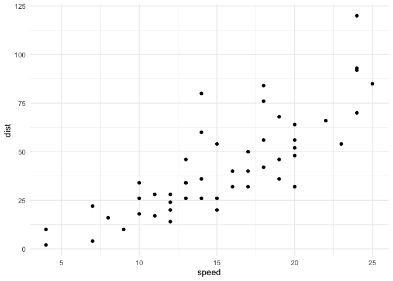
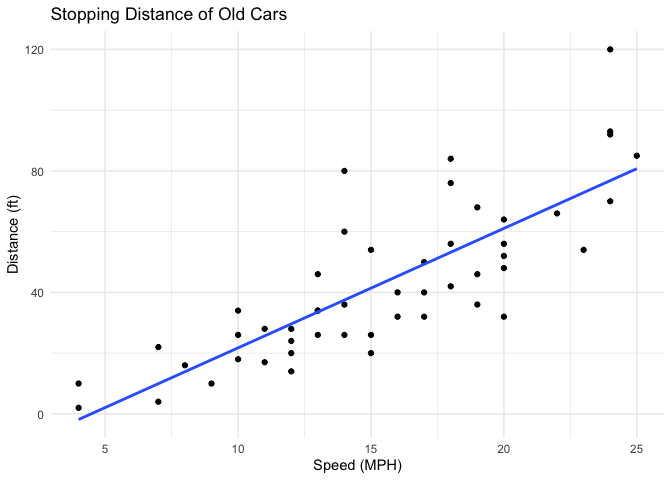
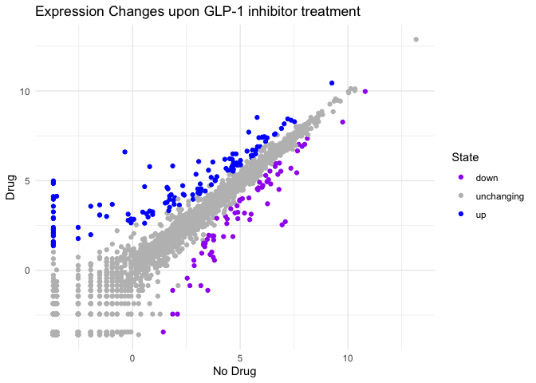
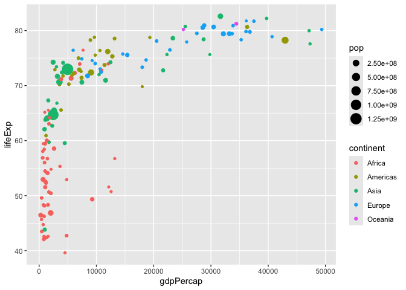
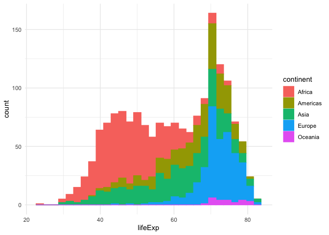
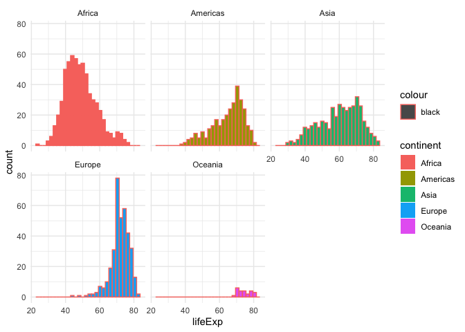

# Class 5: Data Viz with ggplot2
Mason Dinh (PID: A19140455)

- [Background](#background)
- [Gene Expression figure](#gene-expression-figure)
- [Going Further](#going-further)

## Background

There are many graphics systems in R for making plots and figures. These
include so-called *“base R” graphics* like the \`plot()’ function and
add on packages lke **ggplot2**.

Let’s compare how we make a simple figure with these two systems:

We can use the in-built `cars` dataset:

``` r
head(cars)
```

      speed dist
    1     4    2
    2     4   10
    3     7    4
    4     7   22
    5     8   16
    6     9   10

``` r
plot(cars)
```


Before I can use ggplot2 I need to install it on my computer. To do this
we can use the function `install.packages("ggplot2")`

> **N.B.** we never run `install.packages()` in our quarto doc (we run
> it once only in our R console) as it would re-install the pacakge
> every time we render our quarto report.

Once installed we need to load up the package into our R brain:

``` r
library(ggplot2)
```

The main function in the **ggplot2** package is called `ggplot()`

``` r
ggplot(cars)
```


Every ggplot has at least 3 layers:

- the **data**(a data.frame of the stuff we want to plot)
- the **aes**thetics (how the datamaps to the plot),
- the **geom** layer (how you want the plot drawn, e.g. points, lines,
  histogram, etc)

``` r
ggplot(cars) + aes(x= speed, y=dist) +geom_point()+theme_minimal()
```



\##add some custom features

Let’s add a trend line that shows the relationship between speed and
distance.

``` r
ggplot(cars) + aes(x= speed, y=dist) +geom_point()+theme_minimal()+ geom_smooth(method = "lm",se = FALSE)+labs(title="Stopping Distance of Old Cars",x="Speed (MPH)",y="Distance (ft)")
```

    `geom_smooth()` using formula = 'y ~ x'



Q: can you make the `geom_smooth()` function produce a linear straight
line fit to the data and turn off the “gray” error region. A: use
geom_smooth(method = “lm”, se = FALSE)

## Gene Expression figure

Import the data to plot

``` r
url <- "https://bioboot.github.io/bimm143_S20/class-material/up_down_expression.txt"
genes <- read.delim(url)
head(genes)
```

            Gene Condition1 Condition2      State
    1      A4GNT -3.6808610 -3.4401355 unchanging
    2       AAAS  4.5479580  4.3864126 unchanging
    3      AASDH  3.7190695  3.4787276 unchanging
    4       AATF  5.0784720  5.0151916 unchanging
    5       AATK  0.4711421  0.5598642 unchanging
    6 AB015752.4 -3.6808610 -3.5921390 unchanging

``` r
sum(genes$State == "up")
```

    [1] 127

A useful new function in this context is the `table()` function:

``` r
table(genes$State)
```


          down unchanging         up 
            72       4997        127 

My first plot attempt

``` r
ggplot(genes)+aes(Condition1,Condition2,col=State)+geom_point() + scale_colour_manual( values=c("purple","gray","blue") ) +theme_minimal()+labs(x="No Drug",y="Drug",title="Expression Changes upon GLP-1 inhibitor treatment")
```



## Going Further

Here we read the famous gapminder dataset:

``` r
url <- "https://raw.githubusercontent.com/jennybc/gapminder/master/inst/extdata/gapminder.tsv"

gapminder <- read.delim(url)
head(gapminder)
```

          country continent year lifeExp      pop gdpPercap
    1 Afghanistan      Asia 1952  28.801  8425333  779.4453
    2 Afghanistan      Asia 1957  30.332  9240934  820.8530
    3 Afghanistan      Asia 1962  31.997 10267083  853.1007
    4 Afghanistan      Asia 1967  34.020 11537966  836.1971
    5 Afghanistan      Asia 1972  36.088 13079460  739.9811
    6 Afghanistan      Asia 1977  38.438 14880372  786.1134

> Q. how many entries (i.e. rows) are in this dataset?

``` r
nrow(gapminder)
```

    [1] 1704

> Q. How many different “country” entries are in this dataset?

``` r
length(unique(gapminder$country))
```

    [1] 142

Let’s make our first plot of the entire dataset:

Plot of “gdpPercap” vs “lifeExp” colored by “continent”

``` r
p<-ggplot(gapminder)+aes(gdpPercap, lifeExp, col=continent)+geom_point(alpha=0.3)
```

``` r
p
```


I can add more layers using `p`

``` r
p + facet_wrap(~continent)
```


Make a plot for years 1977 and 2007 only (not all the yaers in the
dataset.)

> Q. First use the **dplyr** package and the `filter()` function from
> that package to extrat the year 2007

``` r
library(dplyr)
```

``` r
g07<-filter(gapminder,year == 2007)
g77<-filter(gapminder,year == 1977)
g<-filter(gapminder,year == 2007 | year == 1977)
```

``` r
ggplot(g07)+aes(gdpPercap,lifeExp,col=continent,size=pop)+geom_point()
```



> Q. Make a histogram of lifeExp colored by continent (try using
> `fill=continent` or `col=continent`) Q. Make a histogram of lifeExp
> faceted by continent

``` r
ggplot(gapminder)+aes(lifeExp,col=continent,fill = continent)+geom_histogram()+theme_minimal()
```

    `stat_bin()` using `bins = 30`. Pick better value `binwidth`.



``` r
ggplot(gapminder)+aes(lifeExp,col="black",fill =continent
                    )+geom_histogram()+facet_wrap(~continent)+theme_minimal()
```

    `stat_bin()` using `bins = 30`. Pick better value `binwidth`.


